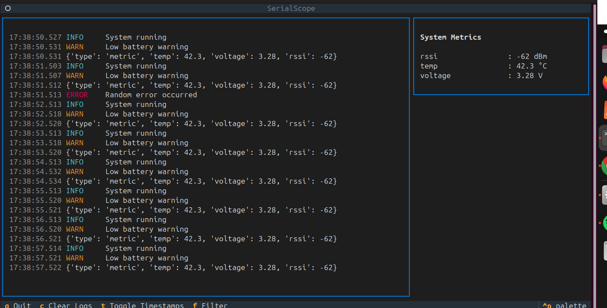
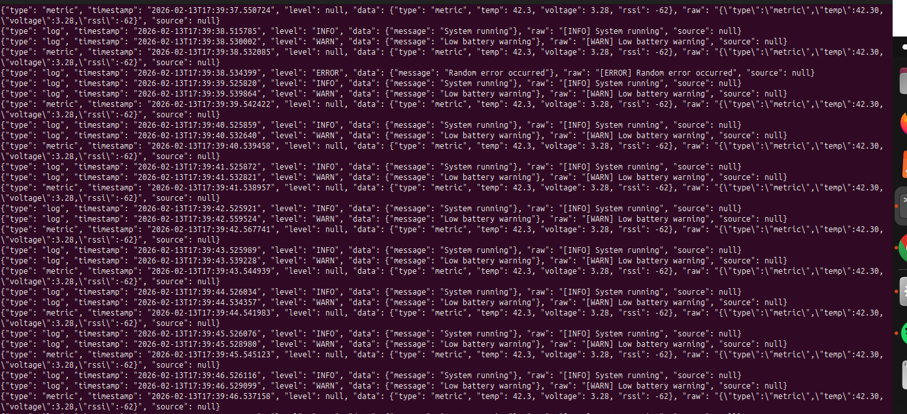

# SerialScope

> A Modular Serial Telemetry & Debug Framework for Embedded Systems

[](https://github.com/yourusername/serialscope/actions)
[](https://www.python.org/downloads/)
[](https://opensource.org/licenses/MIT)

SerialScope is a professional-grade serial debugging and telemetry framework for embedded systems (ESP32, STM32, RP2040, etc.). It goes beyond simple serial monitors by providing structured logging, real-time telemetry dashboards, packet decoding, plugin architecture, recording & replay, and live plotting.

## 📸 Screenshots





## 🎯 Features

- **Structured Logging**: Parse plain text, JSON, or binary data into unified events
- **Real-time Dashboard**: Terminal UI with split-pane layout showing logs and metrics
- **Smart Filtering**: Filter by log level, regex search, and pattern highlighting
- **Recording & Replay**: Save sessions and replay them for post-analysis
- **Plugin Architecture**: Extensible system for custom handlers and visualizers
- **Auto-detection**: Automatically detect serial ports and data formats
- **Thread-safe**: Robust serial communication with auto-reconnect

## 🏗 Architecture

```
                +--------------------+
                |  Serial Interface  |
                +--------------------+
                          |
                          v
                +--------------------+
                |   Stream Parser    |
                +--------------------+
                          |
          +---------------+----------------+
          |                                |
          v                                v
+------------------+              +------------------+
|  Log Processor   |              | Telemetry Router |
+------------------+              +------------------+
          |                                |
          v                                v
+------------------+              +------------------+
|   Log Console    |              |  Dashboard UI    |
+------------------+              +------------------+
                          |
                          v
                +--------------------+
                | Recorder / Replay  |
                +--------------------+
```

## 📦 Installation

### From Source

```bash
git clone https://github.com/joaopaulo-bertoncini/serialscope.git
cd serialscope
python -m venv venv
source venv/bin/activate  # On Windows: venv\Scripts\activate
pip install -r requirements.txt
pip install -e .
```

## 🚀 Quick Start

### Basic Usage

```bash
# Auto-detect port and connect
serialscope --port auto --baud 115200

# Specify port manually
serialscope --port /dev/ttyUSB0 --baud 115200

# Filter only errors
serialscope --port auto --filter ERROR

# Record session
serialscope --port auto --record

# Replay session
serialscope --replay session_2026-02-12.log
```

### CLI Options

```bash
serialscope --help
```

**Serial Connection:**
- `--port`: Serial port (e.g., `/dev/ttyUSB0`, `COM3`, or `auto`)
- `--baud`: Baud rate (default: 115200). Common values: 9600, 115200, 230400, 460800
- `--timeout`: Read timeout in seconds (default: 1.0)

**Common Baud Rates:**
- **115200** - Default, most common for ESP32/STM32 ⭐
- **9600** - Legacy compatibility
- **230400** - High speed
- **460800** - Very high speed
- See [BAUD_RATES.md](docs/BAUD_RATES.md) for complete list

**Parser Options:**
- `--mode`: Parser mode (`plain`, `json`, `binary`, `auto`)
- `--json`: Force JSON parsing mode

**Filtering:**
- `--filter`: Filter logs by level (e.g., `ERROR`, `WARN`, `INFO`)
- `--search`: Search/highlight pattern (regex)

**Recording/Replay:**
- `--record`: Record session to file
- `--record-file`: Path to record file (default: auto-generated)
- `--replay`: Replay session from file
- `--replay-speed`: Replay speed multiplier (default: 1.0)

**UI Options:**
- `--no-ui`: Disable TUI, output to stdout
- `--plot`: Metrics to plot (e.g., `--plot temp voltage`)

## 📖 Usage Examples

### Example 1: Basic Monitoring

```bash
serialscope --port auto --baud 115200
```

### Example 2: JSON Telemetry

If your ESP32 outputs JSON:

```cpp
Serial.println("{\"type\":\"metric\",\"temp\":42.3,\"voltage\":3.28}");
```

Run with:

```bash
serialscope --port auto --json
```

### Example 3: Error Filtering

```bash
serialscope --port auto --filter ERROR
```

### Example 4: Recording Session

```bash
serialscope --port auto --record --record-file my_session.log
```

### Example 5: Replay Session

```bash
serialscope --replay my_session.log --replay-speed 2.0
```

## 🔌 Plugin System

Create custom plugins to extend functionality:

```python
from serialscope.core.event import Event, EventType
from serialscope.plugins.base import register_plugin

@register_plugin("imu_decoder")
def imu_handler(event: Event) -> Optional[Event]:
    if event.type == EventType.METRIC and "imu" in event.data:
        # Process IMU data
        accel_x = event.data.get("accel_x", 0)
        accel_y = event.data.get("accel_y", 0)
        # ... custom processing
    return event
```

## 🧪 Testing

Run tests:

```bash
# Install test dependencies
pip install -r requirements.txt

# Run all tests
pytest

# Run with coverage
pytest --cov=serialscope --cov-report=html

# Run specific test file
pytest tests/unit/test_event.py
```

## 🏛 Project Structure

```
serialscope/
│
├── core/              # Core modules
│   ├── serial_manager.py    # Serial interface layer
│   ├── parser.py            # Stream parser
│   └── event.py             # Event abstraction
│
├── ui/                # UI components
│   ├── dashboard.py         # Main dashboard
│   └── log_panel.py         # Log display panel
│
├── plugins/           # Plugin system
│   └── base.py              # Plugin base classes
│
├── recorder/          # Recording/replay
│   └── session.py           # Session management
│
└── main.py           # CLI entry point

tests/
├── unit/             # Unit tests
└── integration/      # Integration tests

.github/
└── workflows/
    └── ci.yml        # CI/CD pipeline
```

## 🔧 Development

### Setup Development Environment

```bash
# Clone repository
git clone https://github.com/joaopaulo-bertoncini/serialscope.git
cd serialscope

# Create virtual environment
python -m venv venv
source venv/bin/activate

# Install dependencies
pip install -r requirements.txt
pip install -e .

# Install development tools
pip install black ruff mypy pytest pytest-cov
```

### Code Quality

```bash
# Format code
black serialscope tests

# Lint
ruff check serialscope tests

# Type check
mypy serialscope
```

## 📊 Supported Data Formats

### Plain Text Logs

```
[INFO] Boot complete
[ERROR] Sensor failed
[WARN] Low battery
```

### JSON Logs

```json
{"level":"INFO","temp":42.3,"voltage":3.28}
{"type":"metric","rssi":-62,"cpu_usage":45.2}
```

### Binary Packets

```
[HEADER][LEN][PAYLOAD][CRC]
```

## 🎨 Terminal UI

The dashboard provides:

- **Log Panel**: Scrollable log display with filtering
- **Metrics Panel**: Real-time telemetry values
- **Keyboard Shortcuts**:
  - `q`: Quit
  - `c`: Clear logs
  - `t`: Toggle timestamps
  - `f`: Filter menu

## 🤝 Contributing

Contributions are welcome! Please:

1. Fork the repository
2. Create a feature branch (`git checkout -b feature/amazing-feature`)
3. Commit your changes (`git commit -m 'Add amazing feature'`)
4. Push to the branch (`git push origin feature/amazing-feature`)
5. Open a Pull Request

## 📝 License

This project is licensed under the MIT License - see the LICENSE file for details.

## 🙏 Acknowledgments

- Built with [Textual](https://textual.textualize.io/) for terminal UI
- Uses [Rich](https://rich.readthedocs.io/) for beautiful terminal output
- Serial communication via [pyserial](https://github.com/pyserial/pyserial)

## 📧 Contact

For questions or issues, please open an issue on GitHub.

---

**Made with ❤️ for embedded systems developers**
